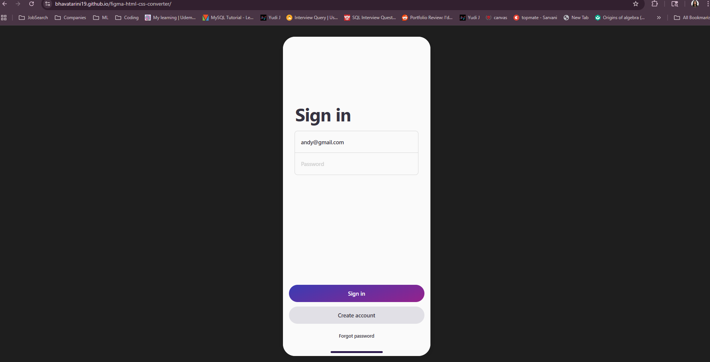

# Figma to HTML/CSS Converter

A production-ready tool that converts Figma designs into semantic HTML/CSS with high visual fidelity.

## Tech Stack

- **TypeScript, Node.js**
- **Figma REST API**
- **Axios** for API calls
- **HTML5/CSS3** generation
- **Local JSON caching**

## ⚠️ Known Limitations

This project focuses on static, pixel-accurate mocks. The following limitations are expected and transparently documented:

### 1. Auto-layout (Partial Support)
Flexbox is used for basic auto-layout rules (direction, gap, padding). Advanced behaviors (hug/fit content, min/max constraints, space-between distribution) are not fully replicated.

### 2. Absolute Positioning
All nodes are absolutely positioned for pixel accuracy. This matches static mocks but not dynamic responsive layouts.

### 3. Images & Icons
Image fills and vector icons are not yet exported. Would require additional Figma Images API / SVG handling.

### 4. Complex Vector Paths
Boolean shapes, irregular polygons, or custom SVG paths are not fully mapped. Best rendered through SVG export rather than CSS.

### 5. Advanced Strokes
Inside/outside stroke alignment is approximated. Custom dash patterns cannot be perfectly reproduced in CSS.

### 6. Text Metrics
Minor text-box differences (1–20px) may occur due to browser rendering vs. Figma's font engine.

## 🚀 Future Improvements

- **Full auto-layout engine** — Complete replication of Figma's layout system
- **Image fill support** — Export image fills via Figma Images API
- **SVG export for vector nodes** — Proper handling of complex vector shapes
- **Perfect stroke alignment** — Accurate inside/outside border rendering
- **Responsive output generation** — Media queries and responsive breakpoints
- **Custom font downloading** — Automatic font loading based on Figma text styles
- **Full boolean operations support** — Union, subtract, intersect operations
- **Component variants handling** — Support for Figma component variants

## Overview

This tool takes a Figma file as input and produces:
- `output/index.html` — semantic HTML
- `output/styles.css` — fully generated CSS

The output renders closely to the original mock, with support for layout, spacing, gradients, shadows, borders, typography, and components such as inputs and buttons.

## Preview



## Features

✔ **Generalizes to any Figma file** — Pattern-based component detection (not hardcoded)

✔ **High-fidelity CSS style extraction** — Colors, gradients, opacity, borders, multiple strokes, shadows, blurs, blend modes, line-height, letter spacing, font weights, rounded corners & masking

✔ **Semantic HTML** — Buttons → `<button>`, inputs → `<input>`, text → `<p>`, frames → `<div>`

✔ **Caching** — Figma file JSON is cached to improve speed and avoid API rate limits

## Setup

### 1. Install dependencies
```bash
npm install
```

### 2. Configure Figma API key

Add to `.env`:
```env
FIGMA_API_KEY=your_token
FIGMA_FILE_KEY=your_file_id_or_url
```

Or pass via CLI as shown below.

### 3. Build the project
```bash
npm run build
```

## How to Run

### Run using a file ID
```bash
npm start -- --file-id jdDi3XNhUrIIaSCI7mVjmR
```

### Run using full Figma URL

**Windows PowerShell:**
```powershell
$env:FIGMA_FILE_KEY="https://www.figma.com/design/jdDi3XNhUrIIaSCI7mVjmR/Your-File-Name?node-id=0-1&p=f&t=YGfjrAuFusDbUSH5-0"
npm start
```

**macOS/Linux:**
```bash
FIGMA_FILE_KEY="https://www.figma.com/design/jdDi3XNhUrIIaSCI7mVjmR/Your-File-Name?node-id=0-1&p=f&t=YGfjrAuFusDbUSH5-0" npm start
```

### Run using .env file
Create `.env`:
```env
FIGMA_FILE_KEY=jdDi3XNhUrIIaSCI7mVjmR
FIGMA_API_KEY=your_figma_personal_access_token
```

Then run:
```bash
npm start
```

### Run using local JSON (debug mode)
```bash
npm start -- --local-json cache/example.json
```

### Disable caching
```bash
npm start -- --file-id jdDi3XNhUrIIaSCI7mVjmR --no-cache
```

## Project Structure

```
src/
 ├── figma_api/      # API client + caching
 ├── parser/         # Figma → Intermediate Representation
 ├── renderer/       # IR → HTML + CSS
 ├── types/          # Shared types
 └── index.ts        # Entry point
```

## Output

After running the tool:
- `output/index.html`
- `output/styles.css`

Open them directly in any browser.

## Optional Bonus: GitHub Pages Hosting

1. Copy your output files into `/docs`:
   ```bash
   cp output/index.html docs/index.html
   cp output/styles.css docs/styles.css
   ```

2. Commit and push:
   ```bash
   git add docs/
   git commit -m "Add GitHub Pages output"
   git push
   ```

3. Enable GitHub Pages:
   - Go to **Settings** → **Pages**
   - Select **Source**: `/docs` folder
   - Click **Save**

4. Your live demo will be available at:
   ```
   https://your-username.github.io/figma-converter/
   ```

## License

This project is a take-home assignment submission.
